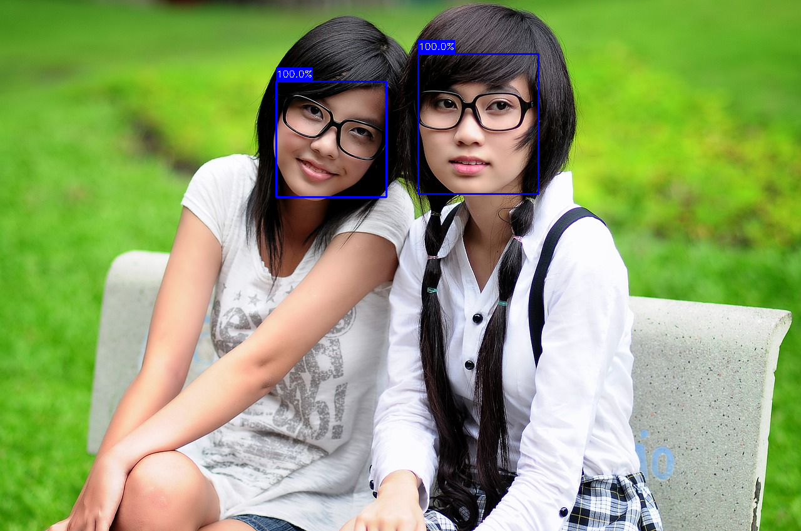
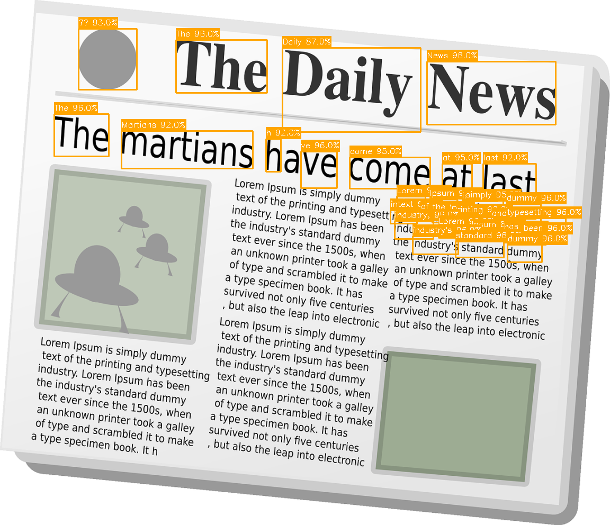
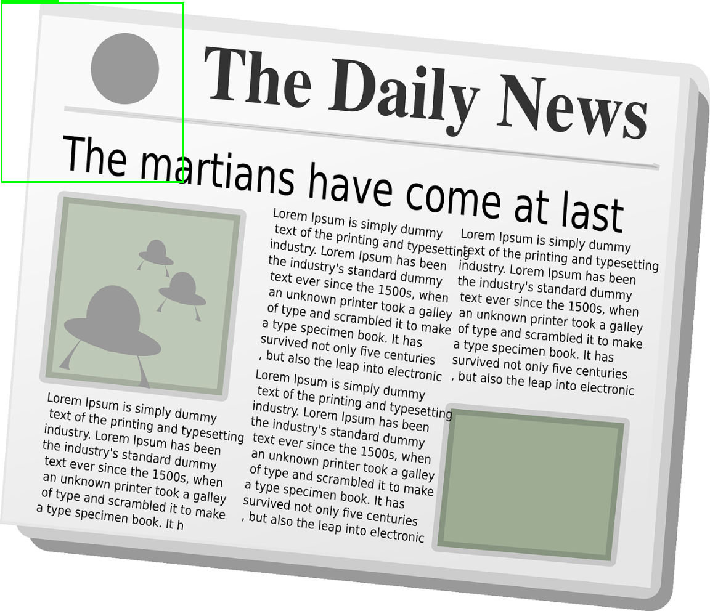

# Vision Tool Server

Local AI-powered vision tools for OpenWebUI using Intel NCS2 and Google Coral USB Accelerator.

**Latest Updates (November 2, 2025):**
- ✅ **Annotated images** with bounding boxes and labels returned as base64 in JSON responses
- ✅ Intel NCS2 MYRIAD plugin support (OpenVINO 2022.1.0 custom build)
- ✅ Automatic image token optimization for LLM context management
- ✅ Smart geometric scaling with 75% token reduction on large images

## Hardware
- Intel Neural Compute Stick 2 (Movidius MyriadX)
- Google Coral USB Accelerator

## Features

### Available Tools
1. **Object Detection** - Detect and locate objects in images (Google Coral)
2. **Image Classification** - Classify images into categories (Google Coral)
3. **Text Extraction (OCR)** - Extract text from images
4. **Face Detection** - Detect faces with age/gender estimation (Intel NCS2)
5. **Scene Analysis** - Comprehensive scene understanding

### Image Token Optimization
Automatically resizes large images to fit within LLM context limits:
- **Token Estimation:** Predicts image token usage based on dimensions
- **Geometric Scaling:** Maintains aspect ratio while reducing tokens by 75%
- **Exponential Backoff:** Progressive targets (3500, 2800, 2000 tokens)
- **Metadata:** Returns optimization details in API responses

## Quick Start

See [SETUP_GUIDE.md](SETUP_GUIDE.md) for detailed installation instructions.

### Prerequisites
- Ubuntu 22.04 (Jammy)
- Python 3.9 (required for pycoral compatibility)
- Google Coral Edge TPU runtime
- libedgetpu1-std
- OpenVINO 2022.1.0 with MYRIAD plugin (see [CLAUDE.md](CLAUDE.md) for build instructions)

### Basic Setup
```bash
# 1. Install Python 3.9
sudo add-apt-repository ppa:deadsnakes/ppa
sudo apt-get update
sudo apt-get install -y python3.9 python3.9-venv python3.9-dev

# 2. Create virtual environment
python3.9 -m venv venv
source venv/bin/activate

# 3. Install dependencies
pip install -r requirements.txt

# 4. Install pycoral (pre-built wheels)
wget https://github.com/google-coral/pycoral/releases/download/v2.0.0/pycoral-2.0.0-cp39-cp39-linux_x86_64.whl
wget https://github.com/google-coral/pycoral/releases/download/v2.0.0/tflite_runtime-2.5.0.post1-cp39-cp39-linux_x86_64.whl
pip install pycoral-2.0.0-cp39-cp39-linux_x86_64.whl tflite_runtime-2.5.0.post1-cp39-cp39-linux_x86_64.whl

# 5. Download models
python download_models.py

# 6. Start server
./start_server.sh
```

## Running as a Service

```bash
# Copy service file
sudo cp vision-tool-server.service /etc/systemd/system/

# Enable and start
sudo systemctl daemon-reload
sudo systemctl enable vision-tool-server
sudo systemctl start vision-tool-server

# Check status
sudo systemctl status vision-tool-server
```

## API Documentation
Once running, visit: http://localhost:8000/docs

## Remote Access via SSH Tunnel

**For accessing from your local machine when server is remote:**

The server runs on `ml-compute02` (internal IP: `10.0.1.23`) but is not exposed externally. Use SSH port forwarding to access all services locally:

```bash
# From your local machine, create SSH tunnel for all services
ssh -L 8000:localhost:8000 -L 3000:localhost:3000 -L 11434:localhost:11434 mark@ml-compute02

# Now access services locally at:
# Vision Tool Server:  http://localhost:8000/docs
# OpenWebUI:           http://localhost:3000
# Ollama API:          http://localhost:11434
```

**For persistent tunnel (runs in background):**
```bash
ssh -fN -L 8000:localhost:8000 -L 3000:localhost:3000 -L 11434:localhost:11434 mark@ml-compute02

# Kill the tunnel later
pkill -f "ssh -fN -L 8000:localhost:8000"
```

**Port breakdown:**
- `8000` = Vision Tool Server (FastAPI)
- `3000` = OpenWebUI (web interface, maps to container port 8080)
- `11434` = Ollama (LLM inference API)

**SSH flags:**
- `-L [local_port]:localhost:[remote_port]` = Forward local port to remote port
- `-f` = Background the SSH connection
- `-N` = Don't execute remote commands (tunnel only)

## Examples

All API endpoints now return annotated images with bounding boxes and labels in base64 format. See the `examples/` directory for sample outputs from each endpoint.

### Object Detection

Detects and localizes objects in images using Google Coral Edge TPU.

**Input Image:**


**Annotated Output:**


**JSON Response:**
```json
{
  "success": true,
  "objects": [
    {
      "label": "person",
      "confidence": 0.871,
      "bounding_box": {"ymin": 11, "xmin": 19, "ymax": 295, "xmax": 158}
    },
    {
      "label": "person",
      "confidence": 0.871,
      "bounding_box": {"ymin": 7, "xmin": 148, "ymax": 297, "xmax": 248}
    },
    {
      "label": "bench",
      "confidence": 0.559,
      "bounding_box": {"ymin": 156, "xmin": 2, "ymax": 295, "xmax": 295}
    }
  ],
  "count": 3,
  "annotated_image": "<base64 encoded PNG with bounding boxes>"
}
```

### Face Detection

Detects faces using Intel NCS2 with OpenVINO.

**Input Image:**


**Annotated Output:**



**Features:**
- Returns face bounding boxes with confidence scores
- Uses Intel NCS2 MYRIAD accelerator for inference
- Annotated images show detected faces with blue boxes

### OCR (Text Extraction)

Extracts text from images using Tesseract OCR.

**Input Image:**


**Annotated Output:**



**Example Output:**
```json
{
  "success": true,
  "text": "The Martians have come at last...",
  "details": [
    {
      "text": "The Martians",
      "confidence": 0.89,
      "bounding_box": {...}
    }
  ],
  "annotated_image": "<base64 encoded PNG with text regions>"
}
```

### Scene Analysis

Comprehensive analysis combining object detection, classification, OCR, and face detection.

**Input Image:**


**Annotated Output:**



**Features:**
- Multi-colored bounding boxes (green=objects, blue=faces, orange=text)
- Returns human-readable summary
- Combines all detection types in single analysis

**Example Summary:**
```
"This appears to be laptop, laptop computer (57.8% confident).
I can see: book. Contains text (30 words): The Martians have come at last..."
```

## Integration with OpenWebUI

**For Docker containers (recommended):**
Add the tool server URL in OpenWebUI using the Docker bridge IP:
```
http://172.17.0.1:8000/openapi.json
```

**For local OpenWebUI:**
```
http://localhost:8000/openapi.json
```

**For remote OpenWebUI (via SSH tunnel):**
If OpenWebUI is running remotely and you're accessing via tunnel:
```
http://localhost:8000/openapi.json
```

### Configuration Steps
1. Open OpenWebUI (http://localhost:3000)
2. Navigate to: Admin Panel → Settings → Tools
3. Add tool server URL: `http://172.17.0.1:8000/openapi.json`
4. Save configuration

The vision tools will now be available when you upload images!
